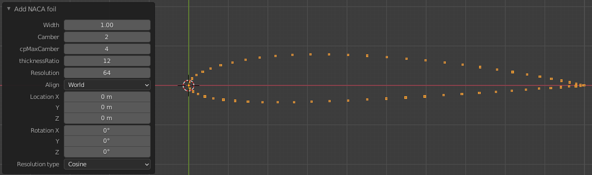

# Blender 2.9 addon for making airfoil profiles
Generates outline of profiles useful for converting to face and exporting to .stl file for further use with OpenFOAM (snappyHexMesh).

## How to install
1. Edit > Preferences > Add-ons > Install
1. Navigate to where naca4digit.py was downloaded to
1. Install Add-on
1. Make sure it is enabled by searching Add 4-digit NACA profile outline
1. Enjoy!

## How to obtain a face
Modelling > Select all vertices > click F
